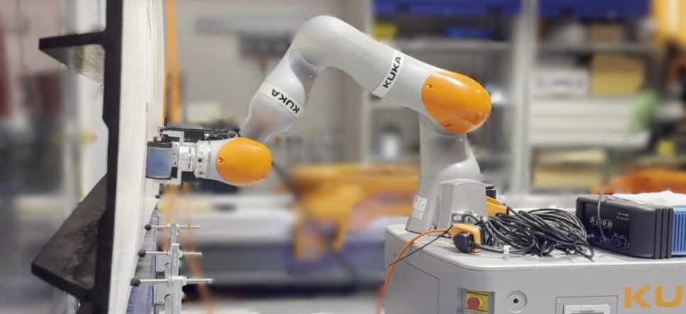

## ROS Enabled Non-Destructive Testing for Aerospace Manufacturing

## Outline
### Problem
Robotic non-destructive testing (NDT) of large-scale structures is a bottle-neck for manufacturing due to components having to be transported to a dedicated NDT cell, precisely fixtured and often moved during the NDT process due to reach constraints.

### Ask
If robotic NDT could be deployed in a more flexible manor, inspections would not be so resource intensive. This could lead to increasing manufacturing through-put or facilitate inspection earlier during manufacture, at stages when corrective action of faults is easier to implement. This study will investigate how advances in mobile collaborative robots could be applied for the task of NDT to address these issues.

### Primary Objective
Create a flexible, automated NDT system for large scale high value components which can be used in a collaborative environment.

### Secondary Objectives
- Flexibility in task definition and deployment i.e. different part geometries, locations, etc.
- Flexibility in the hardware around the NDT use case to allow for different probe types and NDT modalities

---

## Implementation
### Priors
We felt that it was important to have the system not be aware of any CAD data for the test specimens at this stage of development. As such, the only required prior information for the system is as follows:
- Robot's own 3D geometry
- 2D map for localisation and planning
- Fiducial marker associated to test specimen
- Volume tied to the fiducial marker, where the test specimen will lie

### General Hardware
- [KUKA KMR Mobile Base and iiwa Collaborative Manipulator](https://www.kuka.com/en-gb/products/amr-autonomous-mobile-robotics/mobile-robot-systems/kmr-iiwa)
- [Dell Precision 5570 Laptop (deployed on robot)](https://www.dell.com/en-uk/shop/laptops-2-in-1-pcs/precision-5570-workstation/spd/precision-15-5570-laptop)
- Monitoring PC (deployed off robot)

### Software
The software deployed for this project utilises a proprietary ROS Noetic driver for the KMR mobile base provided by KUKA. This provides access to the KMR's onboard SICK laser scanners, odometry data and allows for commanding the base. This driver was integrated with the [ROS navigation stack](https://github.com/ros-planning/navigation) for control of the mobile base, manipulator control uses IFL-CAMP's [iiwa_stack](https://github.com/IFL-CAMP/iiwa_stack) and we utilise [BehaviorTree.CPP](https://github.com/BehaviorTree/BehaviorTree.CPP) for behaviour orchestration.

Other key open source dependencies are:
- [apriltag_ros](https://github.com/AprilRobotics/apriltag_ros), from April Robotics
- [noether](https://github.com/ros-industrial/noether), from SWRi and ROS-Industrial
- [vdbfusion_ros](https://github.com/PRBonn/vdbfusion_ros), from PRBonn

---

## Eddy Current Array Inspection of Aluminium Fuselage Section
This specimen is a multi-layer aluminium skin fuselage section with several intentional defects created to allow for validation.



The mock defects all take the form of 9.7 mm diameter flat bottom holes of depths between 0.7 mm and 1.6 mm at various locations around the panel. Additionally, there are two intentional 6.4 mm diameter through holes in the panel.



### Eddy Current Deployment Specific Hardware


- A: [Eddyfi Low Frequency EC Array](https://www.eddyfi.com/en/product/padded-eca-probes)
- B: [Intel RealSense D415 RGB-D Camera](https://www.intelrealsense.com/depth-camera-d415/)
- C: [Eddyfi Ectane 2 Coil Driver and Acquisition Unit](https://www.eddyfi.com/doc/Downloadables/201908_Eddyfi-ECTANE2-specification-sheet_8_5x11-01.pdf)

### Eddy Current Inspection Demonstration Video
This particular demonstration sets out to convey: 
- the flexibility of the system to the location of the test specimen within a given manufacturing cell
- the lack of use of CAD data as a prior
- the feasibility of deployment of eddy current as an NDT modality

    

        <iframe src="https://www.youtube.com/embed/pKusfRcnj2g?vq=hd720&mute=1&rel=0" width="1280" height="720" frameborder="0" scrolling="no" allowfullscreen title="241007.mp4" style="border:none; position: absolute; top: 0; left: 0; right: 0; bottom: 0; height: 100%; max-width: 100%;">
        </iframe>
    

### Eddy Current Reconstruction
The matrix of coils in the eddy current array allows for data to be simultaneously collected in two separate firing patterns, axial and transversal. Reconstructions of these two acquisitions are provided below depicting the lower area of the test specimen, scanned with nine passes to provide coverage of 1.75 m in length and 0.45 m in height. The geometry of the array provides an array axis resolution of 0.94 mm, with sampling alternating between axial and transversal firing patterns. The array’s velocity was controlled to 0.05 m/s, with eddy current readings collected at 100 Hz, yielding a scan axis resolution of 0.5 mm. This provided a total of 1.88 million data points over the specimen inspection.

<!--  -->
<!--  -->
<!-- As we are encoding our data as pointclouds we can directly overlay the two data sets. -->
<!--  -->



The previously shown 9.7 mm diameter defects A, C, E and F can be easily found in both acquisitions.





As can the 6.4 mm diameter surface breaking through holes that make up part of the fuselage design.



---

## Phased Array Ultrasound Inspection of Carbon Fibre Wing Cover
This demonstrative test specimen is a carbon fibre composite wing cover panel of varying thickness, with T stringers on the rear of the panel to add rigidity.



### Ultrasound Deployment Specific Hardware


- A: [Olympus RollerFORM Phased Array Wheel Probe](https://ims.evidentscientific.com/en/products/industrial-scanners/rollerform)
- B: [Zivid Two M70 Structured Light Camera](https://www.zivid.com/zivid-2-m70)
- C: [Peak LTPA Phased Array Testing Unit](https://www.peakndt.com/products/micropulse-ltpa/)

### Ultrasound Inspection Demonstration Video
This particular demonstration sets out to convey: 
- the flexibility of the system to a deployment in a new location with a different test specimen
- the lack of use of CAD data as a prior
- the feasibility of deployment of phased array ultrasound as an NDT modality

    

        <iframe src="https://www.youtube.com/embed/_zuf87AcRIw?vq=hd720&mute=1&rel=0" width="1280" height="720" frameborder="0" scrolling="no" allowfullscreen title="241007.mp4" style="border:none; position: absolute; top: 0; left: 0; right: 0; bottom: 0; height: 100%; max-width: 100%;">
        </iframe>
    

### Ultrasound Reconstruction
The reconstruction below shows an area of 1.5 m in length and 0.5 m in height, reconstructed from ten passes with the roller probe over the surface similar to that shown in the demonstration video above.

<!--  -->


The plot below shows a composite image of ten b-scans corresponding to the same position, 0.4 m, along the specimen's scan axis.



These plots clearly depict the stringer stiffener flanges on the rear of the specimen, showing that the stringer and the bulk of the specimen have good levels of resin consolidation.

---

## Future Work
- Accuracy and repeatability study using metrology grade system as ground truth
- Increase NDT acquisition rates and test viability of higher robot velocities
- Deploy on larger scale mobile manipulator to enable inspection of larger sepcimens
- Work with our industrial partner to see how a library of specimen's CAD data can improve the system

---

## Shared Research Output to Date
- [Stand alone C++ Peak MicroPulse driver](https://github.com/MShields1986/peak_micropulse_driver)
- [ROS wrapper for the Peak MicroPulse driver](https://github.com/MShields1986/peak_ros)
